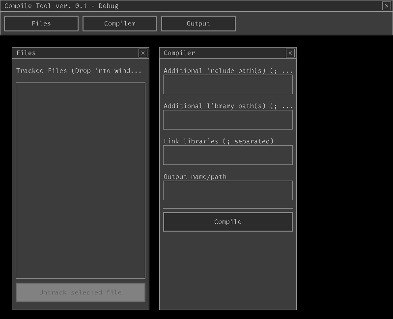
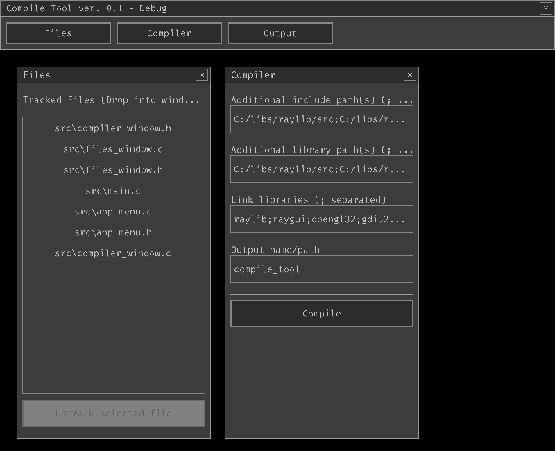
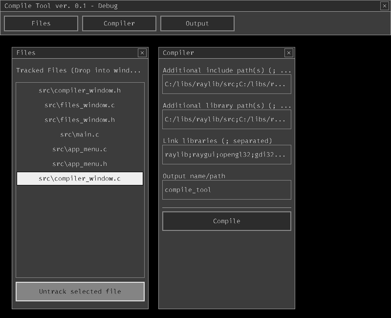
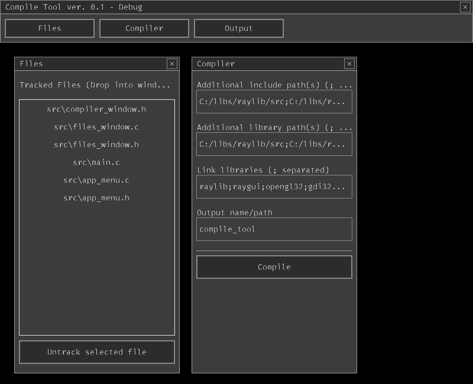

# Compile Tool
Simple and easy to use GUI tool to build C source code built on top of [Raylib](https://github.com/raysan5/raylib) and [Raygui](https://github.com/raysan5/raygui)

> When cloning repo: `git clone --recurse-submodules` <br>
Project depends on submodule [rglp](https://github.com/Dev-Tade/rglp)

---

</img>
</img>
<br>
</img>
</img>

---

## Building
The provided makefile makes easy to build the project, but it requires to have raylib (either built from source or prebuilt) and raygui
* Raylib from source code (You already should have built raylib)
```console
make RAYLIB_PATH=<path to raylib directory> RAYGUI_INCLUDE=<path to directory containing raygui header file>
```
* Raylib precompiled
```console
make RAYLIB_INCLUDE=<path to directory containing raylib header files> RAYLIB_LIBRARY=<path to directory containing raylib library files> RAYGUI_INCLUDE=<path to directory containing raygui header file>
```

---

### Features
1. Drag and drop files to track them
2. Recursively tracks dropped directories
3. Trims the path to the local one
4. Custom window title bar (it does not use system native one)
5. Non locking UI thread (compiling runs on background thread)

### Limitations
* Right now the `only compiler is gcc` because is **hardcoded**
* May be really slow for a large amount of files

---

### Future

[rini](https://github.com/raysan5/rini) will be used for saving project build configurations